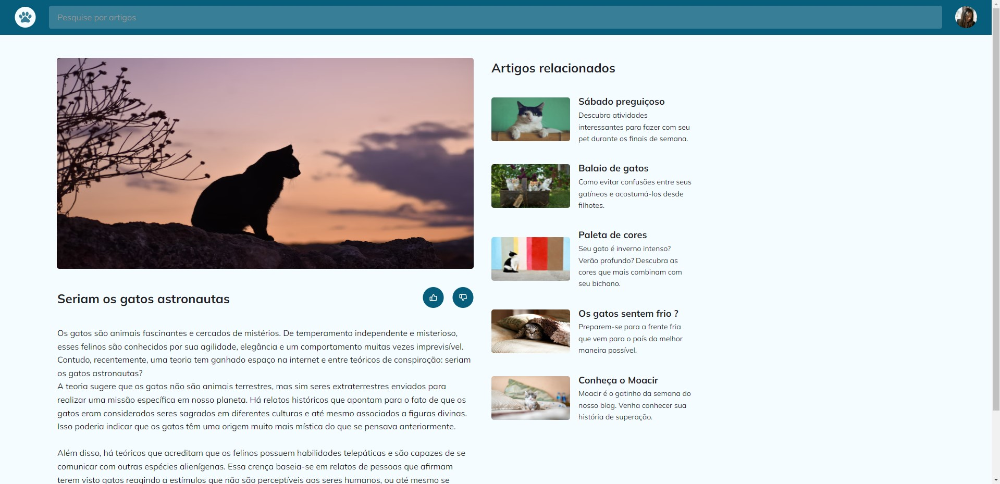

<h1 align="center"> 😺 Catblog 😺</h1>

Projeto pessoal utilizando conceitos de grid-layout e responsividade.

  <a href="#-tecnologias">Tecnologias</a>&nbsp;&nbsp;&nbsp;|&nbsp;&nbsp;&nbsp;
  <a href="#-projeto">Projeto</a>&nbsp;&nbsp;&nbsp;|&nbsp;&nbsp;&nbsp;
  <a href="#-layout">Layout</a>&nbsp;&nbsp;&nbsp;

 

  

## 🚀 Tecnologias

Esse projeto foi desenvolvido com as seguintes tecnologias:

- HTML e CSS
- Git e Github
- Figma

## 💻 Projeto

O Catblog é um pagina em formato blog de curiosidades sobre gatos. Clique <a href="https://catblog-gilt.vercel.app/" target="_blank">aqui</a> para testar a página.

## 🎨 Layout

Clique <a href="https://www.figma.com/file/2iLZuWHv8Hfw6iKjknhq96/Blog-de-Gatos-%E2%80%A2-Desafio-Explorer-(Community)?type=design&t=LfuWWLpGa9XpZYiT-6" target="_blank">aqui</a> para conhecer a prototipagem do projeto.
 
 
 
 

Desenvolvido com ♥ by Mateus de Castro Macedo 👨‍💻

